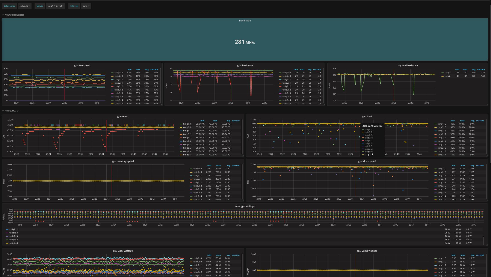

# Installation of grafana

See http://docs.grafana.org/installation/debian/

### Creating the grafana mining dashboad

Import the `grafa-dashboad.json` file into grafana once you've setup telegraf
to ship metrics. This dashboard will auto discover all of your systems and
GPUs and begin reporting metrics on the entire operation.

**Example Dashboad**

