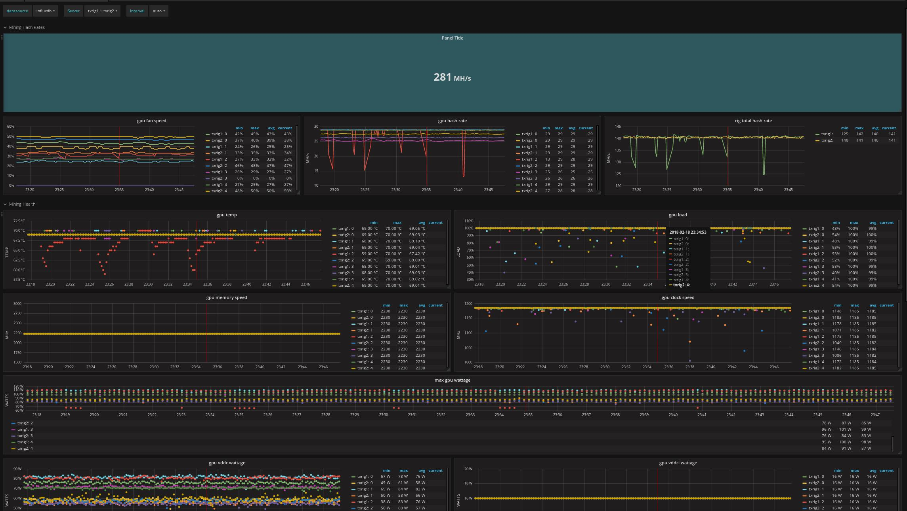

# Python Monitors

These monitors will export data into a telegraf format. At this time they've
only been built to support AMD GPUs. If you want something else pull requests
are welcome.

Before using these monitors install the python systemd library and apt transport
https

``` shell
apt install python-systemd apt-transport-https
```

Execute the monitors like any other script or file to test. To use in production
setup telegraf and have these monitors executed using the `inputs.exec` plugin.


#### Installation of telegraf

See https://docs.influxdata.com/telegraf/v1.5/introduction/installation/

See the example `telegraf.conf` file I'm currently using for monitoring.

#### Installation of influxdb

See https://docs.influxdata.com/influxdb/v1.4/introduction/installation/

#### Installation of grafana

See http://docs.grafana.org/installation/debian/

##### Creating the grafana mining dashboad

Import the `grafa-dashboad.json` file into grafana once you've setup telegraf
to ship metrics. This dashboard will auto discover all of your systems and
GPUs and begin reporting metrics on the entire operation.

**Example Dashboad**

